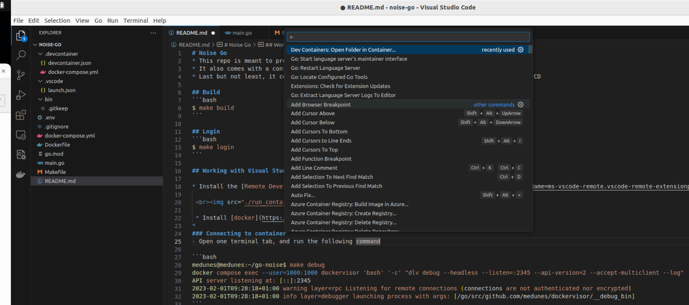
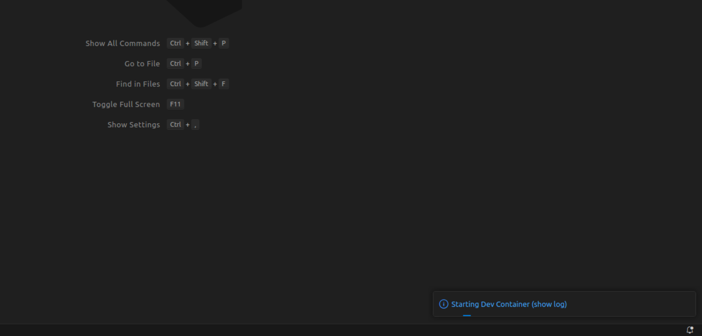
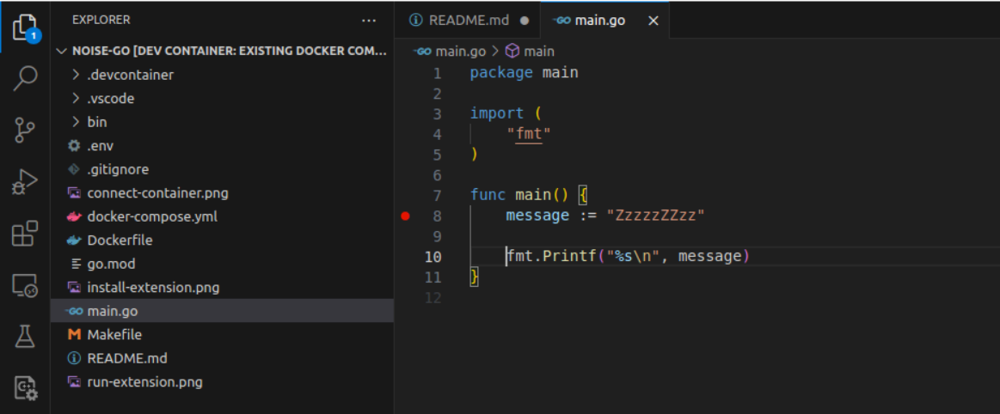
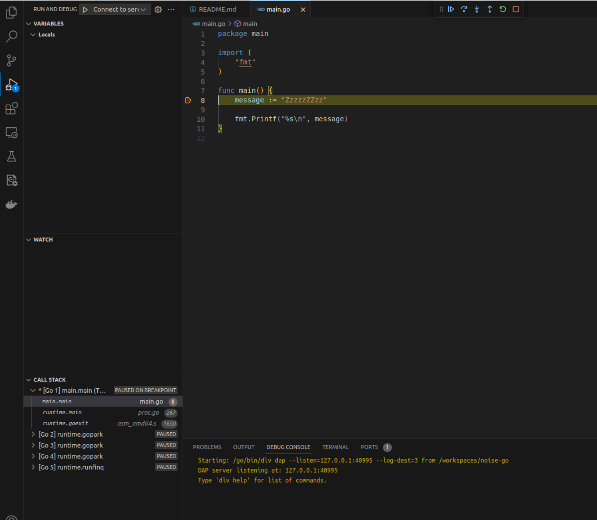

# Noise Go
[](https://github.com/MedUnes/noise-go/actions/workflows/test.yml)

* This repo is meant to provide a startup development boilerplate for Go projects
* It also comes with a container-first mindset 
* Last but not least, it contains github actions for some of the common tasks, kind of minimal CI/CD

## Docker shortcut commands
### Build
```bash
$ make build
```

### Login
```bash
$ make login
```

### Down
```bash
$ make down
```

### Status
```bash
$ make status
```

### Stop
```bash
$ make stop
```

### Restart
```bash
$ make restart
```

### Logs
```bash
$ make logs
```

### Build Go app from host
```bash
$ make gbuild
```

### Run Go app from host
```bash
$ make run
```
## Working with Visual Studio Code

## Prequisites

* Install the [Remote Development Extension Pack](https://marketplace.visualstudio.com/items?itemName=ms-vscode-remote.vscode-remote-extensionpack)

 <br>

 * Install [docker](https://docs.docker.com/engine/install/)


### Connecting to container

* Open one terminal tab, and run the following command ```(Crtl + Shift + P)```
``` Dev Containers: Open Folder in Container... ```

 <br>

* Select the folder that contains the project, in this example it is ```noise-php```
* Visual Studio Code should start connecting to the container
 <br>
* Set a breakpoint on one line of the code of the main function
 <br>
* Press on **F5** (or go to Run -> Start Debugging )
* That's all, now you see the orang line highliting your breakpoint line of code, and you can proceede line by line by pressing the **F10** button
  <br>
* To stop debugging, press **Shift + F5**
